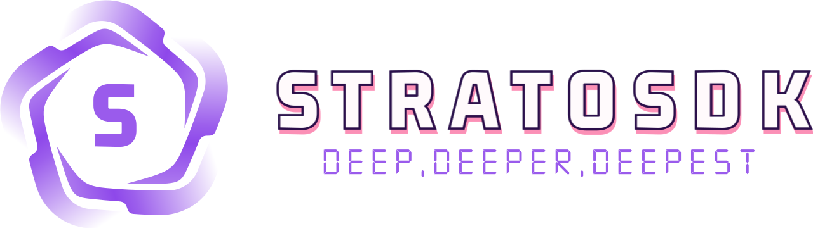
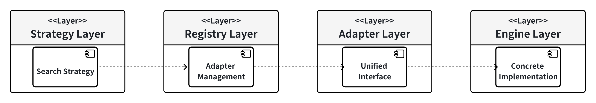

English | [中文](README.zh_CN.md)

**StratoSDK** is an out-of-the-box DeepResearch solution designed to address the lack of unified research tools in current software development. By providing standardized SDK and interface specifications, it helps developers quickly integrate deep research capabilities without reinventing the wheel.

## Feature
In Light version, we focus on web search and provide the following capabilities：
- Intelligent Web Parsing: Support for multiple content processing engines like Jina AI, Firecrawl, and more
- Deep Question Analysis: Automatic question reflection and query splitting for enhanced answer quality
- Multi-Platform Search: Built-in search capabilities for Twitter and other social platforms
- Flexible Configuration: Customizable search depth and breadth settings

## Supported Search Platform
| Platform               | Type                      |    Status   |
| ---------------------- |---------------------------| ----------- |
| [Firecrawl](https://www.firecrawl.dev)               | Web Search API            |    :white_check_mark:   |
| [Jina](https://jina.ai)               | Web Search API            |    :white_check_mark:   |
| [Twitter](https://x.com/home)               | Social Media              |    :white_check_mark:   |
| [Searxng](https://github.com/searxng/searxng)               | Self Hosted Search Engine |    :white_check_mark:   |
| RedNote               | Social Media                   |    :construction:   |
| Bing               |  Search Engine |    :construction:   |
| Google               | Search Engine |    :construction:   |


## QuickStart
This project is mainly to realize the deepsearch function conveniently and quickly, and provides a high degree of configuration customization. Users can expand and develop their own third-party search tools and web crawling tools based on this project. This project is currently in the first version development stage, and many details of the code are handled very roughly, and will be gradually improved in the future

### Install
```go
go get github.com/anboat/strato-sdk@latest
```
### Example
#### Import
```go
package main
import (
    "context"
    "fmt"
    "os"
    "os/signal"
    "github.com/anboat/strato-sdk/config"
    "github.com/anboat/strato-sdk/core/agent"
    "github.com/anboat/strato-sdk/pkg/logging"
    "syscall"
    "time"
)
```
#### Use Case
```go
allConfig := config.LoadConfig("config.yaml")
if allConfig == nil {
    fmt.Printf("Failed to load configuration\n")
    return
}
// Initialize the logger based on the loaded configuration.
logging.InitLoggerFromConfig(&allConfig.Log)
// Create a background context.
ctx := context.Background()
// Create a new streaming research agent.
rAgent, err := agent.NewStreamingResearchAgent(ctx)
if err != nil {
    fmt.Printf("Failed to create streaming research agent: %v\n", err)
    return
}
// Define the research query.
query := "What is the future of AI in 2024?"

// Execute the streaming research process.
thoughtChan, err := rAgent.ResearchWithStreaming(ctx, query)

```
## Project Struture
```python
strato-sdk/
├── adapters/         # Various adapters (search, LLM, large models, web scraping, etc.)
│   ├── llm/          # Large language model adapters
│   ├── search/       # Search engine adapters (e.g., SearxNG, Firecrawl, Twitter, etc.)
│   └── web/          # Web scraping adapters (e.g., Jina, Firecrawl, etc.)
├── config/           # Configuration-related (YAML config, loader, type definitions)
├── core/             # Core business logic
│   └── agent/        # Intelligent agent-related (streaming research agent, tools, etc.)
│   └── tool/          # Tools called in the agent, such as web_process_tool for crawling web page content and search_tool for searching
├── pkg/              # General utility packages (e.g., logging)
├── example_main.go   # Example main program
├── go.mod            # Go module definition
├── README.md         # Project documentation
```

## Tech Intro
### Golang
The current project is developed entirely in Go language, and all core logic, adapters, configurations, tools, etc. are implemented in Go.
### Third-party dependencies
The main third-party dependencies used in this project are: eino, viper, zap.
- **Eino** framework of cloudwego is mainly used for process orchestration to handle the flow and jump process between various process nodes, such as generating sub-questions, flowing to the search node, and then obtaining web page content, and using the model to judge the quality of the current answer to choose the jump.
- **Viper** is mainly used to read config files and manage configuration
- **Zap** is mainly used for log management and implementation
### Design patterns

Let's take the search module as an example to briefly explain the design concept of the code. The search module uses the adapter pattern, factory pattern, strategy pattern, and registry pattern. All engines implement the SearchAdapter interface with a unified interface to shield the differences between different search engines and achieve standardization. The factory pattern can automatically register and create adapters based on the configuration file. The registry pattern provides a global registry to manage all adapters. Different search engines can be dynamically registered as plug-ins (it is necessary to introduce the custom search engine package implemented in the code to call the init method to automatically register it in the registry). You can also manually call the corresponding method for manual registration. The strategy pattern provides different search strategies, such as hybrid search, downgrade, etc.

## License
This repository is licensed under the [MIT License](LICENSE).
## Contact US
We are **Anboat**, a  startup team dedicated to advancing the frontier of Agent application development. As passionate builders in the AI ecosystem, we specialize in creating intelligent solutions that bridge the gap between complex AI capabilities and practical business applications.
To democratize AI agent technology by providing developers with powerful, accessible tools that accelerate the development of intelligent applications. We believe that every developer should have the ability to harness the power of AI agents without getting lost in technical complexity.
- Email: coder@anboat.cn
- GitHub: https://github.com/anboat
- Twitter: @Anboat240326

## Acknowledgement
We extend our heartfelt gratitude to the Eino Team https://github.com/cloudwego/eino for their outstanding contributions to the AI Agent development ecosystem.


